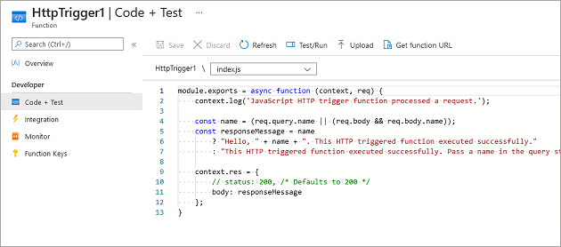

# Chain Azure Functions together using input and output bindings

## Types of bindings

There are two kinds of bindings you can use with functions:

- Input binding - Connects to a data source. Our function can read data from these input sources.

- Output binding - Connects to a data destination. Our function can write data to these output destinations.

There are also triggers, which are special types of input bindings that cause a function to run. For example, an Azure Event Grid notification can be configured as a trigger. When an event occurs, the function runs.

### Common binding types include:

- Blob Storage
- Azure Service Bus Queues
- Azure Cosmos DB
- Azure Event Hubs
- External files
- External tables
- HTTP endpoints

### Binding properties

