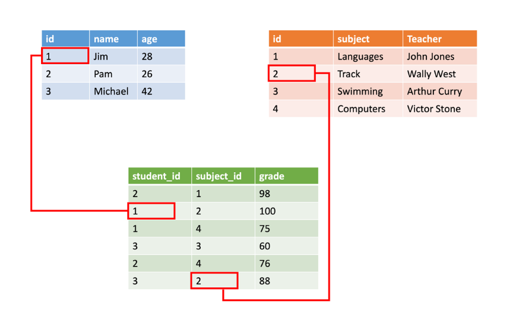

# Choose a data storage approach in Azure

## Classify your data

An online retail business has different types of data. Each type of data might benefit from a different storage solution.

Application data can be classified in one of three ways: structured, semi-structured, and unstructured. Here, you'll learn how to classify your data so that you can choose the appropriate storage solution for the type of data.



```
<Person Age="23">
    <FirstName>Quinn</FirstName>
    <LastName>Anderson</LastName>
    <Hobbies>
        <Hobby Type="Sports">Golf</Hobby>
        <Hobby Type="Leisure">Reading</Hobby>
        <Hobby Type="Leisure">Guitar</Hobby>
   </Hobbies>
</Person>
```

```
{
    "firstName": "Quinn",
    "lastName": "Anderson",
    "age": "23",
    "hobbies": [
        { "type": "Sports", "value": "Golf" },
        { "type": "Leisure", "value": "Reading" },
        { "type": "Leisure", "value": "Guitar" }
    ]
}
```

```
firstName: Quinn
lastName: Anderson
age: 23
hobbies:
    - type: Sports
      value: Golf
    - type: Leisure
      value: Reading
    - type: Leisure
      value: Guitar
```
