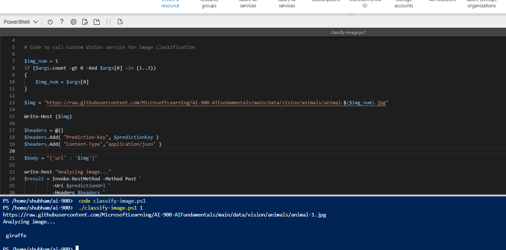

# Classify images with Azure AI Custom

## Uses of image classification

Some potential uses for image classification include:

- Product identification: performing visual searches for specific products in online searches or even, in-store using a mobile device.
- Disaster investigation: identifying key infrastructure for major disaster preparation efforts. For example, identifying bridges and roads in aerial images can help disaster relief teams plan ahead in regions that are not well mapped.
- Medical diagnosis: evaluating images from X-ray or MRI devices could quickly classify specific issues found as cancerous tumors, or many other medical conditions related to medical imaging diagnosis.


```
 rm -r ai-900 -f
 git clone https://github.com/MicrosoftLearning/AI-900-AIFundamentals ai-900
```

```
 cd ai-900
 code classify-image.ps1
```

```
 ./classify-image.ps1 1
```




