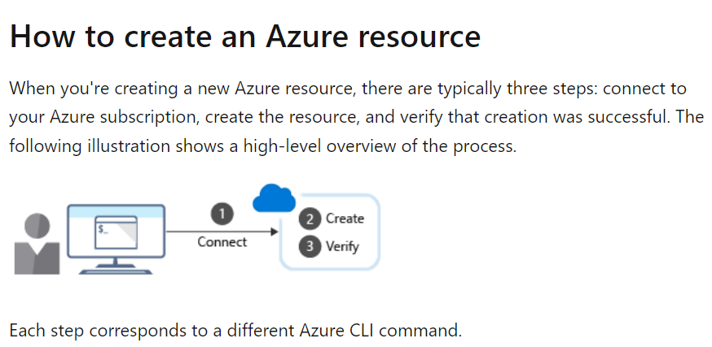
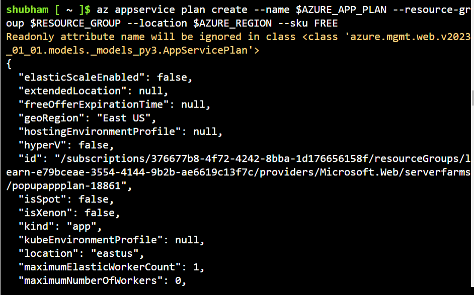
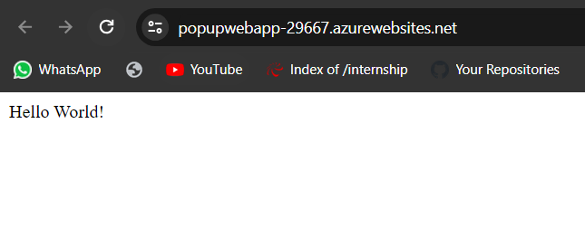

```
az vm restart -g MyResourceGroup -n MyVm
```


```
az find blob
```

```
az find "az vm"
```

```
az find "az vm create"
```

```
az storage blob --help
```



```
az group create --name <name> --location <location>
```

Example

```
az group create --name azurecliegroupdemo --location eastus
```

```
az account set --subscription "Shubham Verma VSEnt–MPN"
```

```Azure Cli
az group list
```

```Azure Cli
az group list --output table
```

```
export RESOURCE_GROUP=learn-e79bceae-3554-4144-9b2b-ae6619c13f7c
export AZURE_REGION=eastus
export AZURE_APP_PLAN=popupappplan-$RANDOM
export AZURE_WEB_APP=popupwebapp-$RANDOM
```

```
az group list --output table
```

```
az group list --query "[?name == '$RESOURCE_GROUP']"
```

```
az appservice plan create --help
```

```
az appservice plan create --name $AZURE_APP_PLAN --resource-group $RESOURCE_GROUP --location $AZURE_REGION --sku FREE
```

## Create a web app

```
az webapp create --name $AZURE_WEB_APP --resource-group $RESOURCE_GROUP --plan $AZURE_APP_PLAN
```



```
az webapp list --output table
```

```
site="http://$AZURE_WEB_APP.azurewebsites.net"
echo $site
```

```
curl $AZURE_WEB_APP.azurewebsites.net
```

output

```
<!DOCTYPE html><html lang="en"><head><meta charset="utf-8"/><meta name="viewport" content="width=device-width, initial-scale=1.0"/><meta http-equiv="X-UA-Compatible" content="IE=edge"/><title>Microsoft Azure App Service - Welcome</title><link rel="shortcut icon" href="https://appservice.azureedge.net/images/app-service/v4/favicon.ico" type="image/x-icon"/><link href="https://appservice.azureedge.net/css/app-service/v4/bootstrap.min.css" rel="stylesheet" crossorigin="anonymous"/><style>html, body{height: 100%; background-color: #ffffff; color: #000000; font-size: 13px;}*{border-radius: 0 !important;}</style> ... (continued)
```

## Deploy code from GitHub

```
az webapp deployment source config --name $AZURE_WEB_APP --resource-group $RESOURCE_GROUP --repo-url "https://github.com/Azure-Samples/php-docs-hello-world" --branch master --manual-integration
```

```
curl $AZURE_WEB_APP.azurewebsites.net
```

output

```
Hello World!
```


