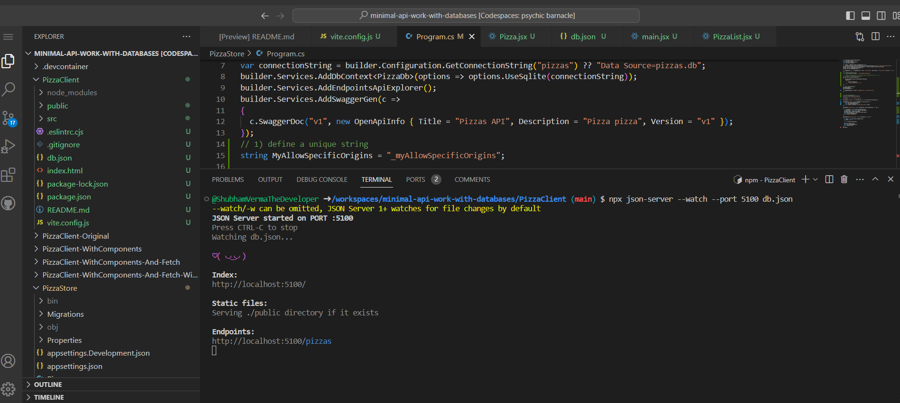

# Create a full stack application by using React and minimal API for ASP.NET Core

## Design a front end for your app

## Which SPA framework do I choose?

- React: React is popular and you can use ES6 and TypeScript. It has great tooling, community, and 3rd-party component offerings.
- Angular: This framework has been around for many years and uses TypeScript heavily. TypeScript resembles C#, and the tooling is good for Angular.
- Vue.js: Vue.js is also a good choice, and many people are using it.
- Svelte: Svelte is relatively new in this context, but it does a great job of looking like you're only working in HTML, JavaScript, and CSS. Its compiler is powerful and able to hide the framework parts to a high degree.
- Next.js: Next.js allows for hybrid static and server-side rendering, and is a great choice for a hybrid app.

## Exercise - Create a front-end app

## Configure dev environment

