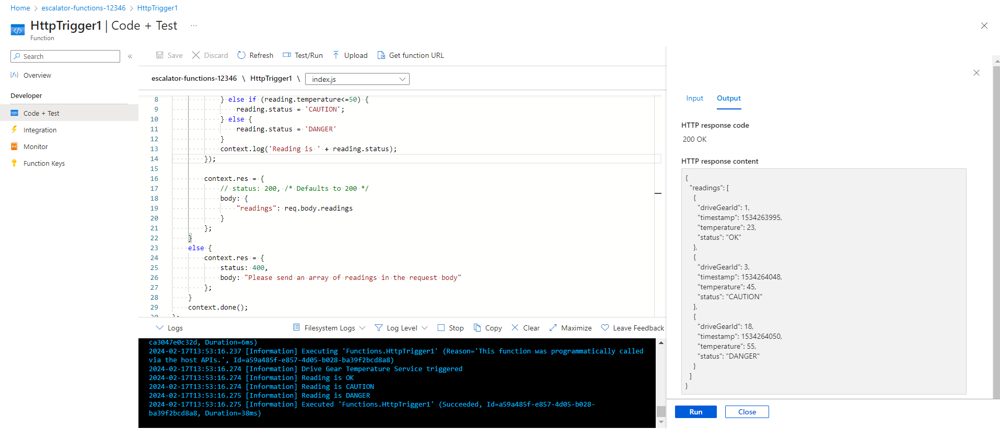

# Create serverless logic with Azure Functions

## What is serverless compute?

Serverless compute can be thought of as a function as a service (FaaS), or a microservice that is hosted on a cloud platform. Your business logic runs as functions and you don't have to manually provision or scale infrastructure. The cloud provider manages infrastructure. Your app is automatically scaled out or down depending on load. Azure has several ways to build this sort of architecture. The two most common approaches are Azure Logic Apps and Azure Functions, which is the focus of this module.

## Verify your Azure function app

When deployment completes, select Go to resource. The Function App pane for your escalator function appears.

In the Essentials section, select the URL link to open it in a browser. A default Azure web page appears with a message that your Functions app is up and running.

curl --header "Content-Type: application/json" --header "x-functions-key: SS5MDrmtiDROlcGMUSuXK70o9XDrua6IQvjLypK3fRElAzFud3gSvQ==" --request POST --data "{\"name\": \"SHUBHAM\"}" https://escalator-functions-12346.azurewebsites.net/api/HttpTrigger1?code=SS5MDrmtiDROlcGMUSuXK70o9XDrua6IQvjLypK3fRElAzFud3gSvQ==

