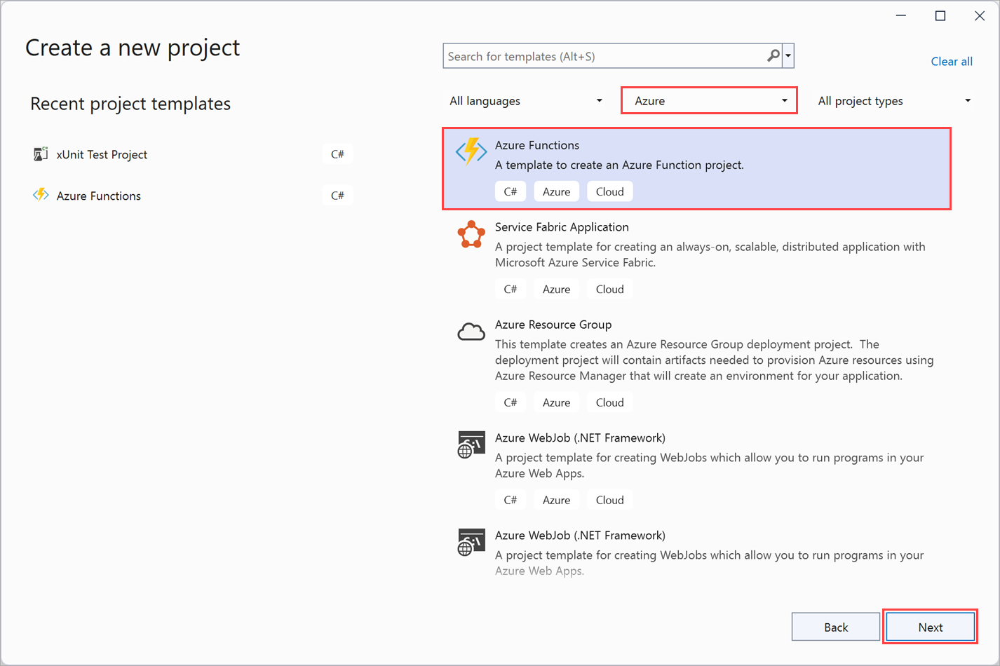

# Develop, test, and deploy an Azure Function with Visual Studio

## Create and test a simple Azure Function locally with Visual Studio

## Modify Visual Studio Install


2. The Modifying - Visual Studio page appears.
   

## Azure Function App

```
public static class Function1
{
    [FunctionName("Function1")]
    public static async Task<IActionResult> Run(
        [HttpTrigger(AuthorizationLevel.Anonymous, "get", "post", Route = null)] HttpRequest req,
        ILogger log)
    {
        log.LogInformation("C# HTTP trigger function processed a request.");

        string name = req.Query["name"];

        string requestBody = await new StreamReader(req.Body).ReadToEndAsync();
        dynamic data = JsonConvert.DeserializeObject(requestBody);
        name = name ?? data?.name;

        return name != null
            ? (ActionResult)new OkObjectResult($"Hello, {name}")
            : new BadRequestObjectResult("Please pass a name on the query string or in the request body");
    }
}
```

```
public static class Function2
{
    [FunctionName("Function2")]
    public static void Run([BlobTrigger("samples-workitems/{name}", Connection = "xxxxxxxxxxxxxxxxxxxxxxx")]Stream myBlob, string name, ILogger log)
    {
        log.LogInformation($"C# Blob trigger function Processed blob\n Name:{name} \n Size: {myBlob.Length} Bytes");
    }
}
```


## Exercise - Create and test a simple Azure Function locally with Visual Studio




```
namespace WatchPortalFunction
{
    public static class Function1
    {
        [FunctionName("Function1")]
        public static async Task<IActionResult> Run(
        [HttpTrigger(AuthorizationLevel.Anonymous, "get", "post", Route = null)] HttpRequest req,
        ILogger log)
        {
            log.LogInformation("C# HTTP trigger function processed a request.");

            string name = req.Query["name"];

            string requestBody = await new StreamReader(req.Body).ReadToEndAsync();
            dynamic data = JsonConvert.DeserializeObject(requestBody);
            name = name ?? data?.name;

            return name != null
                ? (ActionResult)new OkObjectResult($"Hello, {name}")
                : new BadRequestObjectResult("Please pass a name on the query string or in the request body");
        }
    }
}
```

## Create the WatchInfo Azure Function


```
namespace WatchPortalFunction
{
    public static class WatchInfo
    {
        [FunctionName("WatchInfo")]
        public static async Task<IActionResult> Run(
            [HttpTrigger(AuthorizationLevel.Anonymous, "get", "post", Route = null)] HttpRequest req,
            ILogger log)
        {
            log.LogInformation("C# HTTP trigger function processed a request.");
        }
    }
}
```

```
// Retrieve the model id from the query string
string model = req.Query["model"];

// If the user specified a model id, find the details of the model of watch
if (model != null)
{
    // Use dummy data for this example
    dynamic watchinfo = new { Manufacturer = "abc", CaseType = "Solid", Bezel = "Titanium", Dial = "Roman", CaseFinish = "Silver", Jewels = 15 };

    return (ActionResult)new OkObjectResult($"Watch Details: {watchinfo.Manufacturer}, {watchinfo.CaseType}, {watchinfo.Bezel}, {watchinfo.Dial}, {watchinfo.CaseFinish}, {watchinfo.Jewels}");
}
return new BadRequestObjectResult("Please provide a watch model in the query string");
```

## Test the Azure Function locally


## Publish a simple Azure Function

- Bitbucket
- Dropbox
- External repository (Git or Mercurial)
- Git local repository
- GitHub
- OneDrive
- Azure DevOps


## Zip deployment

```
az functionapp deployment source config-zip -g <resource-group> -n <function-app-name> --src <zip-file>
```

## Create an Azure Function App using the Azure portal


## Deploy the WatchInfo function to the Azure Function App


## Verify the functions have been deployed


## Exercise - Unit test an Azure Function

### Create a unit test project


