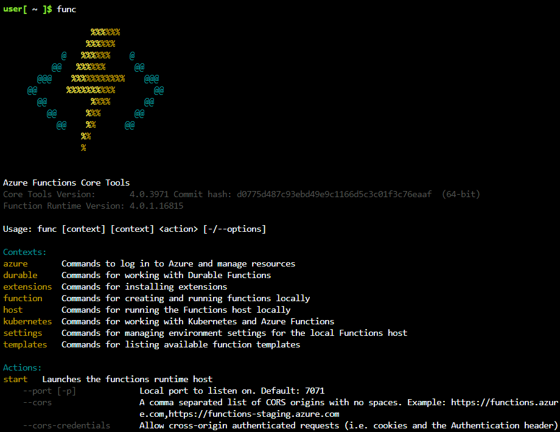

# Develop, test, and publish Azure Functions by using Azure Functions Core Tools

## Create and run Azure Functions locally by using the Core Tools

The Azure Functions Core Tools let you develop and run functions on your local computer from the command line.

You've decided you want to try building your first function, a simple interest calculator, by developing it locally on your own computer and not in the Azure portal's functions editor. You're not sure if you want to use a development environment like Visual Studio or Visual Studio Code, both of which can be extended to support Azure Functions directly. Ultimately, you decide to use the Core Tools from the command line and a basic text editor.

In this module, you'll learn how to use the Core Tools to create and run functions locally. Let's learn more about Core Tools before we use them in the exercise in the next unit, which walks you through these concepts using the Azure Cloud Shell.

## What are the Azure Functions Core Tools?

The Azure Functions Core Tools are a set of command-line tools that you can use to develop and test Azure Functions on your local computer.

The Core Tools feature different kinds of functions-related capabilities, but their primary purpose is to:

- Generate the files and folders you need to develop functions on your local computer.

- Run your functions locally so you can test and debug them.

- Publish your functions to Azure.
  

## Core Tools versions
