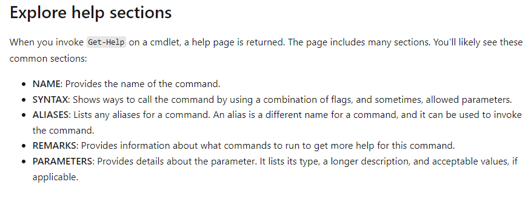
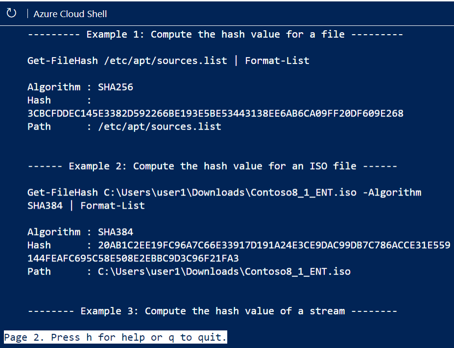
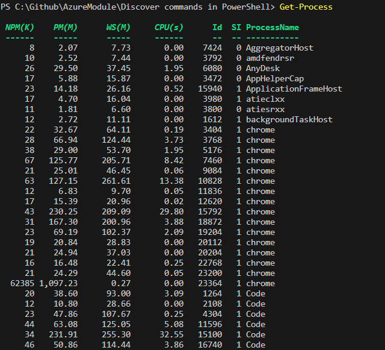
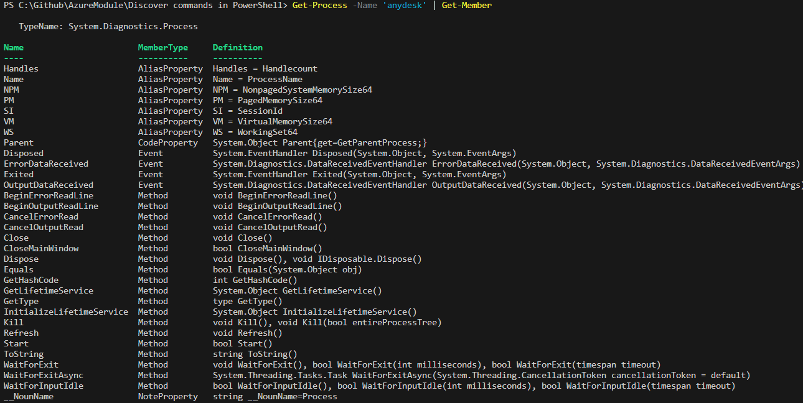
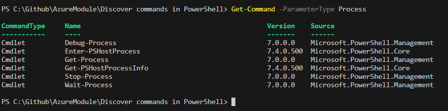

Discover commands in PowerShell

```
Get -Help -Name Get-Help
```

```
Update-Help -UICulture en-US -Verbose
```



```
Get-Help Get-FileHash -Examples
```



```
Get-Process
```



```
Get-Process -Name 'anydesk' | Get-Member
```



```
Get-Command -ParameterType Process
```



https://learn.microsoft.com/api/achievements/share/en-us/ShubhamVerma/DGQWWE3J?sharingId=7BBBB75FB7AF740D
