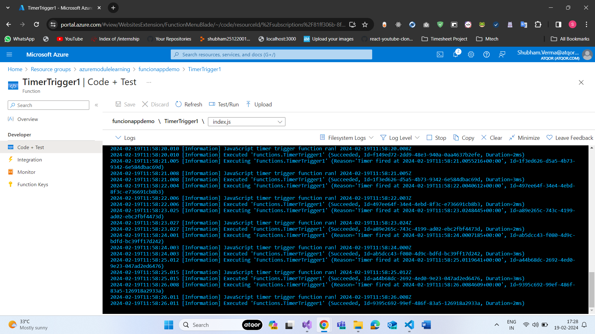

# Execute an Azure Function with triggers

## Determine the best trigger for your Azure function

## What is a trigger?

A trigger is an object that defines a specific function. For example, if you want a function to execute every 10 minutes, you could use a timer trigger.

Every function must have exactly one trigger associated with it. If you want to execute a piece of logic that runs under multiple conditions, you need to create multiple functions that share the same core function code.

## What is a CRON expression?

A timer trigger is a trigger that executes a function at a consistent interval. To create a timer trigger, you need to supply two pieces of information.

1. A Timestamp parameter name, which is simply an identifier to access the trigger in code.
2. A Schedule, which is a CRON expression that sets the interval for the timer.

## What is a CRON expression?

A CRON expression is a string that consists of six fields that represent a set of times.

The order of the six fields in Azure is: {second} {minute} {hour} {day} {month} {day of the week}.

For example, a CRON expression to create a trigger that executes every five minutes looks like: 0 _/5 _ \* \* \*

At first, this string might look confusing. We'll come back and break down these concepts when we have a deeper look at CRON expressions.

To build a CRON expression, you need to have a basic understanding of some of the special characters.

