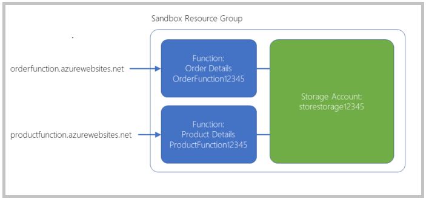

# Expose multiple Azure Function apps as a consistent API by using Azure API Management

## Create a new API in API Management from a function app

The Azure API Management service enables you to construct an API from a set of disparate microservices.

In your online store, each part of the application is implemented as a microservice - one for the product details, one for order details, and so on. A separate team manages each microservice, and each team uses continuous development and delivery to update and deploy their code regularly. You want to find a way to assemble these microservices into a single product and then manage that product centrally.

## Serverless architecture and microservices

Microservices are a popular approach to the architecture of distributed applications. When you build an application as a collection of microservices, you create many different small services. Each service has a defined domain of responsibility, and is developed, deployed, and scaled independently. This modular architecture results in an application that is easier to understand, improve, and test. It also makes continuous delivery easier, because you change only a small part of the whole application when you deploy a microservice.

Another complementary trend in distributed software development is serverless architecture. In this approach, a host organization publishes a set of services that developers can use to run their code. The developers don't have to concern themselves with the supporting hardware, operating systems, underlying software, and other infrastructure. Instead, the code runs in stateless computing resources triggered by requests. Costs are only incurred when the services execute, so you don't pay much for services that are rarely used.

## Azure Functions

Azure Functions is a service that enables serverless architectures in Azure. You can write functions, without worrying about the supporting infrastructure, in many different languages, including C#, Java, JavaScript, PowerShell, and Python. You can also use libraries from NuGet and the Node Package Manager (npm), and authenticate users with the OAuth standard from providers such as Active Directory, Facebook, Google, and Microsoft Account.

When you write a function, you choose a template to use, depending on how you want to trigger your code. For example, if you want to execute the function in response to an HTTP request, use the HTTPTrigger template. You can use other templates to execute when there are new messages in a queue, a Blob storage container, or on a predefined schedule.

When you use Azure Functions in a Consumption Plan, you're charged only for the time that your code runs.

## Azure API Management

Azure API Management is a fully managed cloud service that you can use to publish, secure, transform, maintain, and monitor APIs. It helps organizations publish APIs to external, partner, and internal developers to unlock the potential of their data and services. API Management handles all the tasks involved in mediating API calls. Including, request authentication and authorization, rate limit and quota enforcement, request and response transformation, logging and tracing, and API version management. API Management enables you to create and manage modern API gateways for existing backend services no matter where they're hosted.

Because you can publish Azure Functions through API Management, you can use them to implement a microservices architecture; each function implements a microservice. By adding several functions to a single API Management product, you can build those microservices into an integrated distributed application. Once the application is built, you can use API Management policies to implement caching or ensure security requirements.

## Create functions

1. To clone the functions project, run the following command in Azure Cloud Shell on the right.

```
git clone https://github.com/MicrosoftDocs/mslearn-apim-and-functions.git ~/OnlineStoreFuncs
```

2. Run the following commands in Cloud Shell to set up the necessary Azure resources we need for this exercise.

```
cd ~/OnlineStoreFuncs
bash setup.sh
```


