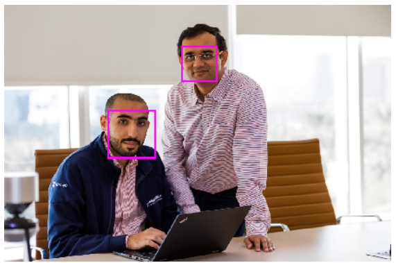
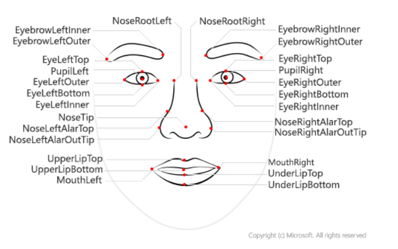
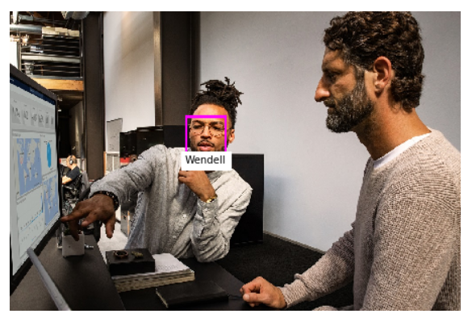

# Fundamentals of Facial Recognition

Face detection and analysis is an area of artificial intelligence (AI) which uses algorithms to locate and analyze human faces in images or video content.

Uses of face detection and analysis
There are many applications for face detection, analysis, and recognition. For example,

- Security - facial recognition can be used in building security applications, and increasingly it is used in smart phones operating systems for unlocking devices.
- Social media - facial recognition can be used to automatically tag known friends in photographs.
- Intelligent monitoring - for example, an automobile might include a system that monitors the driver's face to determine if the driver is looking at the road, looking at a mobile device, or shows signs of tiredness.
- Advertising - analyzing faces in an image can help direct advertisements to an appropriate demographic audience.
- Missing persons - using public cameras systems, facial recognition can be used to identify if a missing person is in the image frame.
- Identity validation - useful at ports of entry kiosks where a person holds a special entry permit.

Microsoft Azure provides multiple Azure AI services that you can use to detect and analyze faces, including:

- Azure AI Vision, which offers face detection and some basic face analysis, such as returning the bounding box coordinates around an image.
- Azure AI Video Indexer, which you can use to detect and identify faces in a video.
- Azure AI Face, which offers pre-built algorithms that can detect, recognize, and analyze faces.
  Of these, Face offers the widest range of facial analysis capabilities.
