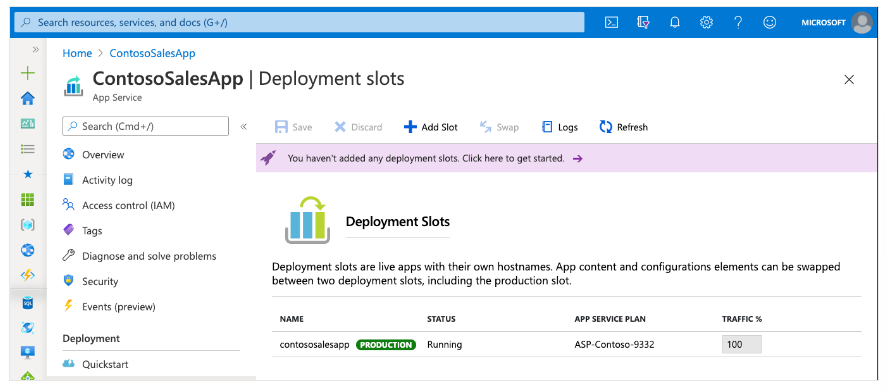
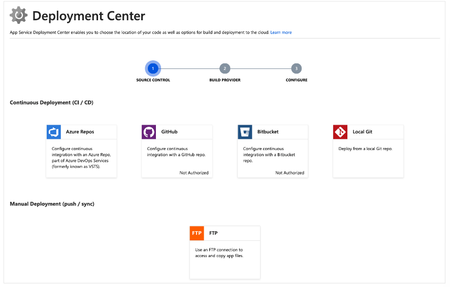
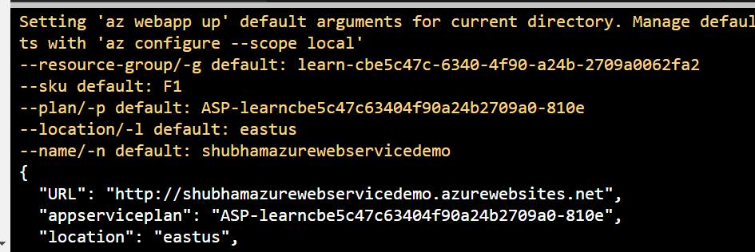
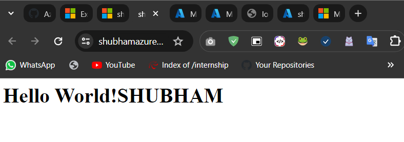

# Create a web app in the Azure portal

## Why use the Azure portal?

The first step in hosting your web application is to create a web app (an Azure App Service app) inside your Azure subscription.

There are several ways you can create a web app. You can use the Azure portal, the Azure Command Line Interface (CLI), a script, or an integrated development environment (IDE) like Visual Studio.

The information in this unit discusses how to use the Azure portal to create a web app, and you'll use this information to create a web app in the next exercise. For this module, we'll demonstrate using the Azure portal because it's a graphical experience, which makes it a great learning tool. The portal helps you discover available features, add additional resources, and customize existing resources.

## What is Azure App Service?

Azure App Service is a fully managed web application hosting platform. This platform as a service (PaaS) offered by Azure allows you to focus on designing and building your app while Azure takes care of the infrastructure to run and scale your applications.

## Deployment slots



## Continuous integration/deployment support



## Creating a web app

Sign in to the Azure portal using the same <b>account</b> you used to activate the sandbox.

1. On the Azure portal menu or from the Home page, select Create a resource. Everything you create on Azure is a resource. The Create a resource pane appears. Here, you can search for the resource you want to create, or select one of the popular resources that people create in the Azure portal.

2. In the Create a resource menu, select Web.

3. Select Web App. If you don't see it, in the search box, search for and select Web App. The Create Web App pane appears.

4. On the Basics tab, enter the following values for each setting.

## Exercise - Write code to implement a web application

```
cd ~
mkdir helloworld
cd helloworld
npm init -y
```

```
touch index.js
```

```
code .
```

```JSON
{
  "name": "helloworld",
  ...
  "scripts": {
    "start": "node index.js"
  },
  ...
}
```

```
const http = require('http');

const server = http.createServer(function(request, response) {
    response.writeHead(200, { "Content-Type": "text/html" });
    response.end("<html><body><h1>Hello World!</h1></body></html>");
});

const port = process.env.PORT || 1337;
server.listen(port);

console.log(`Server running at http://localhost:${port}`);
```

From a new browser tab, browse to https://shell.azure.com/.

```
cd ~/helloworld
npm start
```

```
curl http://127.0.0.1:1337/
```

```HTML
<html><body><h1>Hello World!</h1></body></html>
```

### Deploy code to App Service

#### Automated deployment

Automated deployment, or continuous integration, is a process used to push out new features and bug fixes in a fast and repetitive pattern with minimal impact on end users.

Azure supports automated deployment directly from several sources. The following options are available:

- Azure DevOps: You can push your code to Azure DevOps, build your code in the cloud, run the tests, generate a release from the code, and finally push your code to an Azure Web App.
- GitHub: Azure supports automated deployment directly from GitHub. When you connect your GitHub repository to Azure for automated deployment, any changes you push to your production branch on GitHub will be automatically deployed for you.
- Bitbucket: Due to its similarities to GitHub, you can configure an automated deployment with Bitbucket.
- OneDrive: OneDrive is Microsoft's cloud-based storage. You must have a Microsoft account linked to a OneDrive account to deploy to Azure.
- Dropbox: Azure supports deployment from Dropbox, which is a popular cloud-based storage system similar to OneDrive.

#### Manual deployment

There are a few options that you can use to manually push your code to Azure:

- Git: App Service web apps feature a Git URL that you can add as a remote repository. Pushing to the remote repository will deploy your app.
- az webapp up: webapp up is a feature of the az command-line interface that packages your app and deploys it. Unlike other deployment methods, az webapp up can create a new App Service web app for you if you haven't already created one.
- ZIP deploy: You can use az webapp deployment source config-zip to send a ZIP of your application files to App Service. You can also access ZIP deploy via basic HTTP utilities such as curl.
- WAR deploy: WAR deploy is an App Service deployment mechanism designed for deploying Java web applications using WAR packages. You can access WAR deploy using the Kudu HTTP API located at http://<your-app-name>.scm.azurewebsites.net/api/wardeploy. If that fails, try: https://<your-app-name>.scm.azurewebsites.net/api/wardeploy.
- Visual Studio: Visual Studio features an App Service deployment wizard that walks you through the deployment process.
- FTP/S: FTP or FTPS is a traditional way of pushing your code to many hosting environments, including App Service.

## Deploy with az webapp up

```
export APPNAME=$(az webapp list --query [0].name --output tsv)
export APPRG=$(az webapp list --query [0].resourceGroup --output tsv)
export APPPLAN=$(az appservice plan list --query [0].name --output tsv)
export APPSKU=$(az appservice plan list --query [0].sku.name --output tsv)
export APPLOCATION=$(az appservice plan list --query [0].location --output tsv)
```

```
az webapp up --name $APPNAME --resource-group $APPRG --plan $APPPLAN --sku $APPSKU --location "$APPLOCATION"
```

### Verify the deployment



