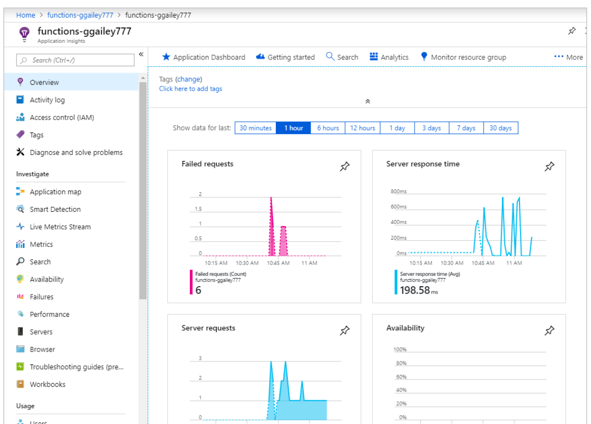

# Introduction to Azure Functions

Azure Functions is a serverless solution that allows you to write less code, maintain less infrastructure, and save on costs. Instead of worrying about deploying and maintaining servers, the cloud infrastructure provides all the up-to-date resources needed to keep your applications running.

Use triggers to decide when to run code
Azure Functions lets you define triggers, which start the execution of your code. Triggers can also process inputs for passing data into your functions. Each function can have only one trigger. Some of the trigger types supported by Azure functions include:

- Storage: You can listen from events from databases like Azure Cosmos DB when a new row is inserted, for example.
- Events: Event Grid and Event Hubs produce events that can trigger your code.
  HTTP code: Web requests and webhooks can trigger HTTP code.
- Queues: Queue messages can be processed, as well.
- Timer: Code can be invoked with a certain time interval.
  Use bindings to connect to data sources. Bindings are ways to simplify coding for input and output data. While you can use client SDKs to connect to services from your function code, Functions provide bindings to simplify these connections. Essentially bindings are connection code you don’t have to write. You can integrate with many services on Azure and solve integration problems and automate business processes.

Bindings comes in two flavors, input, and output. An output binding provides a way to write data to the data source, for example, place a message on a queue or a new row in a database. Input bindings can be used to pass data to your function from a data source different than the one that triggered the function.

Features
There are some features that makes Azure Functions a compelling choice:

Flexible hosting plans. There are three different hosting plans to fit your business needs.

- Consumption plan. This is the fully serverless hosting option for Functions. Functions scale automatically, and you pay for compute resources only when your functions are running. This plan provides cost-efficient compute for short process workloads that tend to be more intermittent with less-predictable loads.
- Premium plan. In this plan, your functions are kept initialized, meaning there’s no delay after being idle. This is a good plan to choose when your function app needs to run for longer periods, but you still need the dynamic scale. This plan also lets you start scaling with more resources faster than with the Consumption plan. In the Consumption plan there’s also limits on the execution time, which this plan can supersede. While you still get the cost benefits of dynamic scale, you pay more.
- Dedicated plan. You run your functions with a regular App Service plan. It’s best for scenarios where your functions need to run continuously. Another benefit is that you fully control how the app scales and can more easily predict costs. This is also a good choice when you have an existing but underutilized App Service plan available.
- Dynamic scaling. In most plans, functions are dynamically scaled based on load. When demand of execution increases, more resources are allocated automatically to the service and when requests fall, resources and application instances drop off automatically. In Consumption plan, you don’t pay at all for idle functions.

- Event based architecture. Functions are meant to be small and focused and process incoming data and be done or raise a new event in turn. Some common usage areas of Azure functions are sending emails, starting backup, order processing, task scheduling such as database clean-up, sending notifications, messages, and IoT data processing.

# When to use Azure Functions

- Reminders and notifications. Azure Functions has a trigger that can be instructed to run at certain intervals making it straight forward to implement such a scenario. You might have scenarios where getting a notification can be business critical.

- Scheduled tasks. Tasks that could use the same time-based triggers. In this case, there could be jobs that need to be done at certain intervals, for example, data cleaning or look for a piece of data.

- Experimental APIs. If you use the Consumption plan, with Functions, you can make millions of calls and pay very little. One thing to keep in mind is that any type of storage incurs a cost.

An example is writing to a database with a function. This plan is ideal to use for prototyping or for Start-ups. In the latter case, if you have so many calls to your functions that most likely means you have paying customers. Hence, Azure Functions scales with your business. As your business grows, you might consider other hosting plans as well.

- Irregular but important business flows. Getting a new customer and onboarding that customer is an example where your code has a good reason to run. Such a flow likely consists of operations like interacting with a data store, sending out emails, and more.

- Queue based. You might have a ticket selling app and requests needs to be processed in a queue like fashion.

- Processing data in real-time. If combined with Azure SignalR, Azure Functions can be made to process data on demand.

- Analyze IoT stream. It’s possible to collect and process data from IoT devices.

- Process file uploads. Run code when a file is uploaded or changed in a blob storage.

- Serverless workflow. A series of functions can be chained together, and you can introduce state which makes it possible to devise complex long running workflows via Durable Functions. Another choice for workflows is Logic apps that can monitor external events, perform branching logic and invoke functions as a result.
