# Introduction to Azure Logic Apps

## What is a business process?

A business process or workflow is a sequence of tasks that produce a specific outcome. The result might be a decision, some data, or a notification.

One of the shoe-company scenarios is monitoring social media for reaction to a new product. The sequence of tasks would be: detect tweets about the product, analyze the sentiment, store a link to positive tweets, and email customer service for negative tweets.

Since the steps occur in a specific order, you often describe them with a flowchart. The following illustration shows a sample flowchart for the social-media monitor process. Notice how there are three types of operations: an event that starts the flow, processing steps that do most of the work, and a conditional operator that makes a decision.
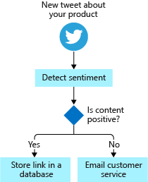

## What is Azure Logic Apps?

Azure Logic Apps is a cloud service that automates the execution of your business processes. You use the workflow designer to arrange premade components into the sequence you need. The designer sends a definition of your workflow to the Azure Logic Apps execution engine. The execution engine launches your app when conditions are right and manages the compute resources needed to run it. The following illustration shows a high-level view of the steps.
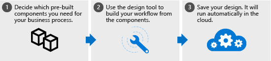
The power of Azure Logic Apps comes from the diversity of the prebuilt components and their ability to work together. The components let you connect to hundreds of external services. The following illustration shows a few of the services you can use in your logic app workflow.
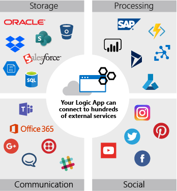
You build your app from the services you use in your business processes. The components can be connected in any pattern you need. You can add conditional statements and loops to add decision making to your app. The following illustration shows how you would combine external services to implement the social-media monitor workflow.
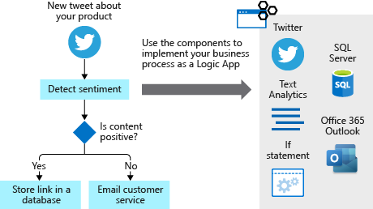
The Azure Logic Apps model is extensible. If there isn't a prebuilt component for the service you need, you can create your own. You can also run custom code in an Azure function that you invoke from your app.

If we had to describe the goal of Azure Logic Apps in one word, we'd choose integration. Azure Logic Apps helps you join disparate services to implement a workflow. Your job is to use the workflow designer to arrange the components into the sequence you need. For most apps, you don't need to write any code and you can be up and running in minutes.

## How Azure Logic Apps works

## What is a connector?

A connector is a component that provides an interface to an external service. For example, the Twitter connector allows you to send and retrieve tweets, while the Office 365 Outlook connector lets you manage your email, calendar, and contacts. Azure Logic Apps provides hundreds of prebuilt connectors that you can use to create your apps.

A connector uses the external service's REST or SOAP API to do its work. When you use a connector in your logic app workflow, the connector calls the service's underlying API for you. The following illustration shows the Twitter connector and its use of the Twitter REST API.
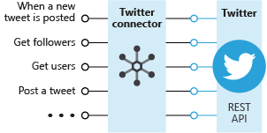

## Custom connectors

You can write custom connectors to access services that don't have prebuilt connectors. The services must have a REST or SOAP API. The requirement that the services provide an API shouldn't be too surprising since connectors are essentially wrappers around that underlying API.

To create a custom connector, you first generate an OpenAPI or Postman description of the API. You then use that API description to create a custom connector resource in the Azure portal. You can give your connector a name, an icon, and a description for each operation. The following illustration shows an example of the process. Notice that there's no coding involved.
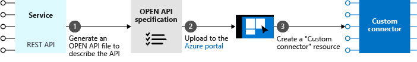

## What are triggers and actions?

Workflows are built from different types of tasks. For example, in our social media monitoring scenario, the workflow starts when a new tweet is posted. The workflow then analyzes the sentiment and makes a decision, based on the sentiment score. Azure Logic Apps uses the terms trigger, action, and control action for these concepts. These operations are the building blocks of Azure Logic Apps. The following diagram shows how to use each type of step in the social media monitoring app.
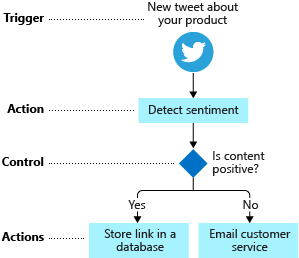
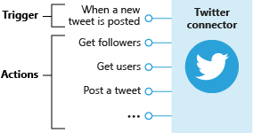
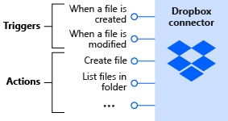
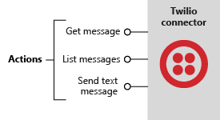

## How to build workflows from triggers and actions

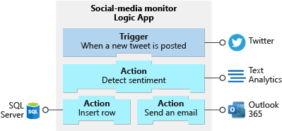

## How do triggers and actions work together?

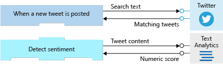
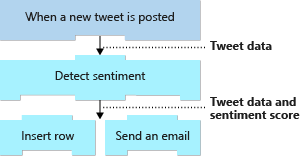

## What are control actions?

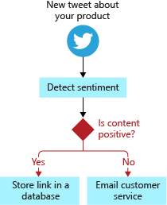
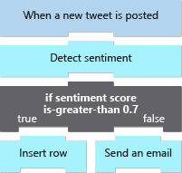

## What is the workflow designer?

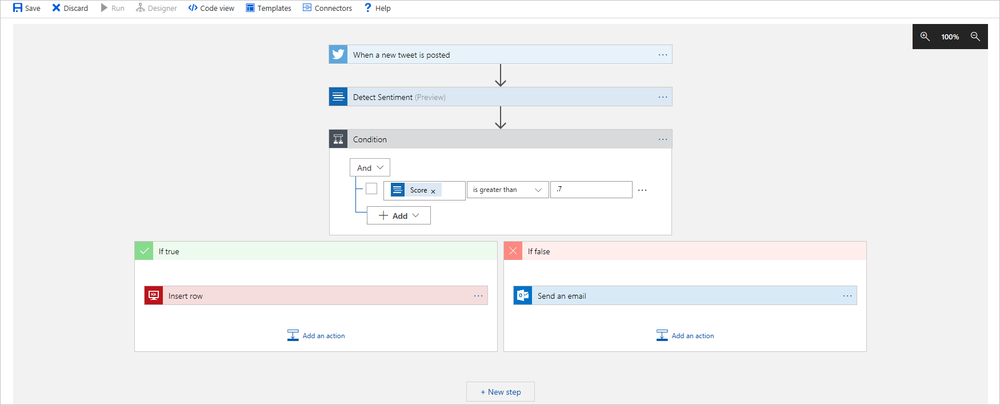
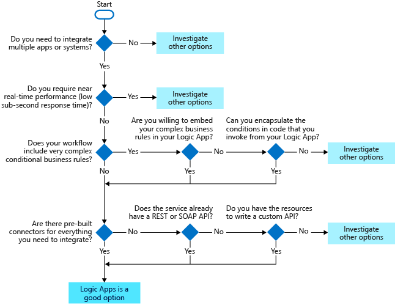
