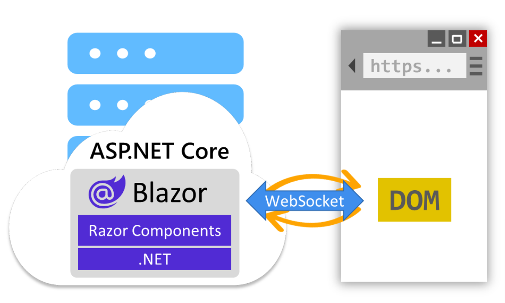
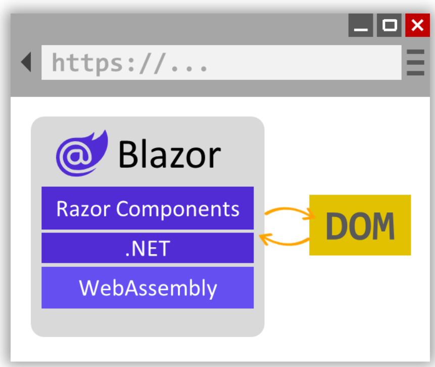

# Introduction to Web Development with Blazor

## What is Blazor?

Blazor is a modern frontend web framework based on HTML, CSS, and C# that helps you build web apps faster. With Blazor you build web apps using reusable components that can be run from both the client and the server so that you can deliver great web experiences. Blazor is part of .NET, a developer platform for building anything. .NET is free, open-source, and runs cross-platform.

```
<h1>Counter</h1>

<p role="status">Current count: @currentCount</p>

<button class="btn btn-primary" @onclick="IncrementCount">Click me</button>

@code {
    private int currentCount = 0;

    private void IncrementCount()
    {
        currentCount++;
    }
}
```





## When to use Blazor

Blazor is a fully featured web UI framework designed to handle the needs of most modern web apps. But whether Blazor is the right framework for you depends on many factors.

You should consider using Blazor for web development if:

- You're looking for a highly productive full stack web development solution.
- You need to deliver web experiences quickly without the need for a separate frontend development team.
- You're already using .NET, and you want to apply your existing .NET skills and resources on the web.
- You need a high-performance and highly scalable backend to power your web app.
