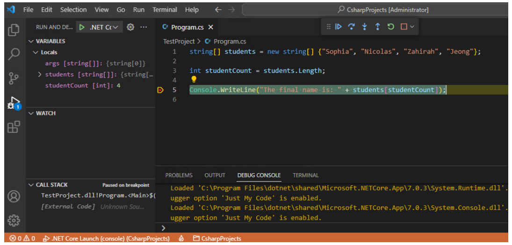

# Review the principles of code debugging and exception handling

## Testing, debugging, and exception handling

- Functional testing - Unit testing - Integration testing - System testing - Acceptance testing
- Nonfunctional testing - Security testing - Performance testing - Usability testing - Compatibility testing

## Code debugging and developer responsibilities

```
string[] students = new string[] {"Sophia", "Nicolas", "Zahirah", "Jeong"};

int studentCount = students.Length;

Console.WriteLine("The final name is: " + students[studentCount]);
```


