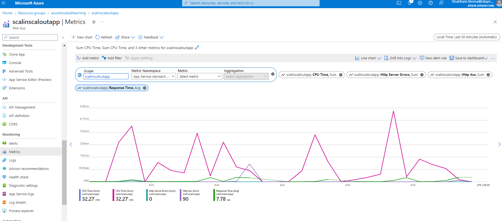

# Scale an App Service web app to efficiently meet demand with App Service scale up and scale out

## App Service plans and scalability

A web app that runs in Azure typically uses Azure App Service to provide the hosting environment. App Service can arrange for multiple instances of the web app to run. It load balances incoming requests across these instances. Each instance runs on a virtual machine.

An App Service plan defines the resources available to each instance. The App Service plan specifies the operating system (Windows or Linux), the hardware (memory, CPU processing capacity, disk storage, and so on), and the availability of services like automatic backup and restore.

- The Free tier provides 1 GB of disk space and support for up to 10 apps, but only a single shared instance and no SLA for availability. Each app has a compute quota of 60 minutes per day. The Free service plan is suitable for app development and testing rather than production deployments.
- The Shared tier provides support for more apps (up to 100) also running on a single shared instance. Apps have a compute quota of 240 minutes per day. There's no availability SLA.
- The Basic tier supports an unlimited number of apps and provides more disk space. Apps can be scaled out to three dedicated instances. This tier provides an SLA of 99.95% availability. There are three levels in this tier that offer varying amounts of computing power, memory, and disk storage.
- The Standard tier also supports an unlimited number of apps. This tier can scale to 10 dedicated instances and has an availability SLA of 99.95%. Like - the Basic tier, this tier has three levels that offer an increasingly powerful set of computing, memory, and disk options.
- The Premium tier gives you up to 20 dedicated instances, an availability SLA of 99.95%, and multiple levels of hardware.
- The Isolated tier runs in a dedicated Azure virtual network, which gives you a network and computes isolation. This tier can scale out to 100 instances and has an availability SLA of 99.95%.

## Create an App Service plan and web app

1. Sign in to the Azure portal.

2. On the Azure portal menu or from the Home page, select Create a resource. The Create a resource pane appears.

3. In the left menu pane, under Categories, select Web, search for and select Web App, and then select Create. The Create Web App pane appears.

4. On the Basics tab, enter the following values for each setting.

## Build and deploy the web app

```
git clone https://github.com/MicrosoftDocs/mslearn-hotel-reservation-system.git
```

```
cd mslearn-hotel-reservation-system/src
```

```
dotnet build
```

```
cd HotelReservationSystem
dotnet publish -o website
```

```
cd website
zip website.zip *
az webapp deployment source config-zip --src website.zip --name <your-webapp-name> --resource-group mslearn-scale
```

```
cd ~/mslearn-hotel-reservation-system/src/HotelReservationSystemTestClient
```

```
code App.config
```

```
<?xml version="1.0" encoding="utf-8" ?>
<configuration>
    <appSettings>
        <add key="NumClients" value="100" />
        <add key="ReservationsServiceURI" value="https://<your-webapp-name>.azurewebsites.net/" />
        <add key="ReservationsServiceCollection" value="api/reservations" />
    </appSettings>
</configuration>
```

```
code HotelReservationSystemTestClient.csproj
```

```
<Project Sdk="Microsoft.NET.Sdk">

  <PropertyGroup>
    <OutputType>Exe</OutputType>
    <TargetFramework>netcoreapp7.0</TargetFramework>
  </PropertyGroup>

  <ItemGroup>
    <PackageReference Include="Newtonsoft.Json" Version="12.0.1" />
    <PackageReference Include="System.Configuration.ConfigurationManager" Version="4.5.0" />
  </ItemGroup>

  <ItemGroup>
    <ProjectReference Include="..\HotelReservationSystemTypes\HotelReservationSystemTypes.csproj" />
  </ItemGroup>

</Project>
```

```
dotnet build
```

```
dotnet run
```


