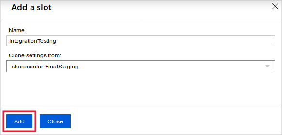
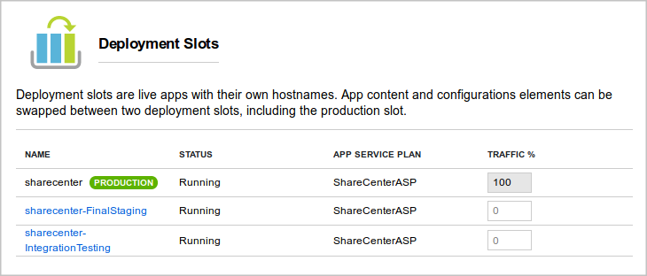
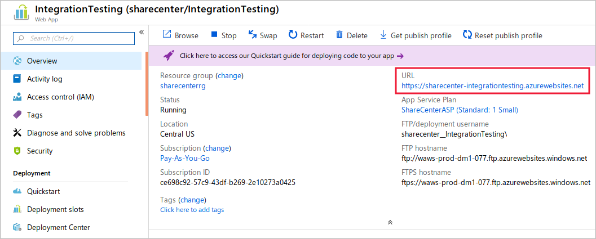
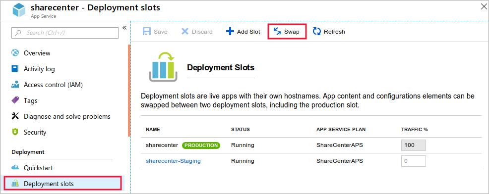
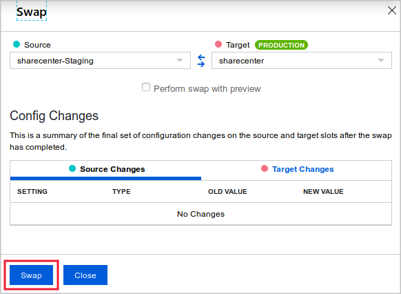
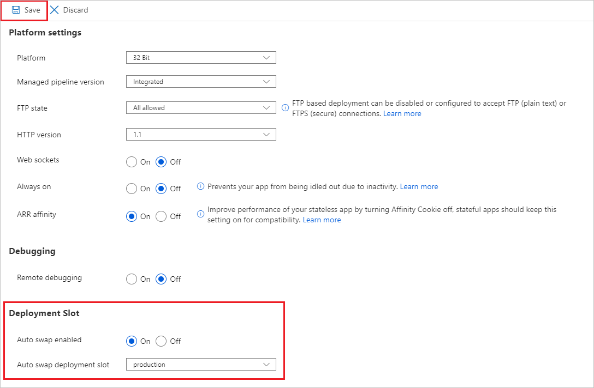

# Stage a web app deployment for testing and rollback by using App Service deployment slots

## Create deployment slots

Organizations often need to run web apps in isolated environments to test them before deployment. They also need to deploy quickly and without affecting users.

Suppose you're trying to decide whether to use slots as a streamlined way to deploy a web app in your social media system. You want to find out if deployment slots will reduce downtime during deployments, if they'll ease rollbacks, and if you can set them up in Azure.

Here, you'll learn how deployment slots ease the testing and rollout of new code.

## Use a deployment slot

Within a single Azure App Service web app, you can create multiple deployment slots. Each slot is a separate instance of that web app, and it has a separate hostname. You can deploy a different version of your web app into each slot.

One slot is the production slot. This slot is the web app that users see when they connect. Make sure that the app deployed to this slot is stable and well tested.

Use additional slots to host new versions of your web app. Against these instances, you can run tests such as integration tests, acceptance tests, and capacity tests. Fix any problems before you move the code to the production slot. Additional slots behave like their own App Service instances, so you can have confidence that your tests show how the app will run in production.

After you're satisfied with the test results for a new app version, deploy it by swapping its slot with the production slot. Unlike a code deployment, a slot swap is instantaneous. When you swap slots, the slot hostnames are exchanged, immediately sending production traffic to the new version of the app. When you use slot swaps to deploy, your app is never exposed to the public web in a partially deployed state.

If you find that, in spite of your careful testing, the new version has a problem, you can roll back the version by swapping the slots back.

### Create deployment slots and tiers

Before you create a slot, make sure your web app is running in the Standard, Premium, or Isolated tier:

Open your web app in the Azure portal.

Select the Deployment Slots pane.

Select Add Slot.

Name the slot.

Choose whether to clone settings from another slot. If you choose to clone, settings are copied to your new slot from the slot you specify.



### Access a slot



## Exercise - Create deployment slots

### Create a web app

Start by creating a new web app resource in the Azure portal.

1. Sign in to the Azure portal.

2. In the resource menu, or from the Home page, select Create a resource. The Create a resource pane appears.

3. In the resource menu, select Web, and from the results, select Web App. The Create Web App pane appears.

4. On the Basics tab, enter the following values for each setting.

## Configure the git client and clone the web app source code

1. In the Azure global controls at the top of the page, select the Cloud Shell icon to launch an Azure Cloud Shell session.
   
2. In the Cloud Shell session, when prompted, select the Bash experience and create storage for your subscription.
3. Enter the following command in the Cloud Shell, replacing <your-username> with your preferred username. This config value isn't associated with any Azure account, so you can use whatever value you like.

```
git config --global user.name <your-username>
```

4. Enter the following command in the Cloud Shell, replacing <your-email-address> with your preferred email address. This config value isn't associated with any Azure account, so you can use whatever value you like.

```
git config --global user.email <your-email-address>
```

4. Enter the following code to create and open a demoapp folder for the source code.

```
git config --global user.email <your-email-address>
```

5. Enter the following code to create and open a demoapp folder for the source code.

```
mkdir demoapp
cd demoapp
```

6. Enter the following code to clone the source for the web app and open your local copy.

```
git clone https://github.com/Azure-Samples/app-service-web-dotnet-get-started.git
cd app-service-web-dotnet-get-started
```

## Configure git deployment

Although you can use many different tools to deploy code to your web app, in this exercise, you'll set up the web app to use a local git repository.

1. In the App Service menu, under Deployment, select Deployment Center. The Deployment Center pane for your app service appears.

2. On the Settings tab, for Source, select Local Git, and then select Save on the command bar to set up your deployment.

3. Select the Local Git/FTPS credentials tab. Under User scope, enter a unique username and password of your choice, and then in the command bar, select Save. Make a note of the username and password for later.

## Configure the git client and clone the web app source code

## Deploy a web app by swapping deployment slots

## Configure slot settings

To view and configure settings for the swap, go to the web app resource and follow these steps:

1. On the Azure portal menu or from the Home page, select All resources, and select the deployment slot you want to configure.

2. Go to the Configuration pane.

3. On the Application settings tab, observe whether the settings you're interested in contain a checkmark in the deployment slot setting field. To set or unset a checkmark on a given setting, select the setting's pencil button to edit it, then toggle the deployment slot setting checkbox to the desired value, and select OK.

## Exercise - Deploy a web app by using deployment slots

### Configure a slot setting\

To configure slot settings:

1. From the All resources view in the Azure portal, go to the Overview page of the production slot of the web app.

2. Navigate to the Configuration pane for the deployment slot.

3. Select + New application setting. Add a new setting with the name ENVIRONMENT_NAME, and a value of production. Check the deployment slot setting box to make this a slot setting. Select OK.

4. Add another setting called APP_VERSION, and enter the value 1. Don't make this a slot setting. Select OK.

5. In the top menu bar, select Save, then select Continue.

6. Repeat the preceding steps on the Staging slot, but use the following values:

## Swap the slots

1. To make sure you're configuring the production slot, select All resources, and then select the production slot of the web app.
2. In the left menu pane, under Deployment, select Deployment slots > Swap.
   
3. Make sure you're about to swap the staging and production slots. Notice how the swap will affect settings. The value of the APP_VERSION setting will be exchanged between the slots, but the value of the ENVIRONMENT slot setting won't be swapped. Select Swap.
   
4. When the swap is complete, go to the Overview page of the production slot's web app, and select Browse. The web app appears on a new browser tab. Notice that version 2 of the web app is now in production.
5. Close the browser tab.

## Configure auto swap for the staging slot

Suppose that now that you're using deployment slots, you want to enable continuous deployment. You'll do this by using the auto swap feature for your web app. In a system that uses auto swap, when you deploy new code to the staging slot, Azure automatically warms it up and deploys it to production by swapping the staging and production slots. To configure auto swap, follow these steps:

1. Go to the Configuration pane of the staging slot's web app and go to the General settings tab.

2. Set Auto swap enabled to On.

3. In the Auto swap deployment slot list, select production, then select Save and Continue.
   

## Deploy new code and auto swap it into production

1. On the right side of Cloud Shell, restart the editor if it's not already running.

```
cd ~/demoapp/app-service-web-dotnet-get-started/
code .
```

2. In the code editor, in the File list on the left, expand aspnet-get-started > Views > Home, and then select Index.cshtml.

```
<h1>Web App Version 2</h1>
```

3. Locate the following code.

```
<h1>Web App Version 2</h1>
```

4. Replace that code with this code.

```
<h1>Web App Version 3</h1>
```

5. To save your changes, press `Ctrl+S`.
6. In Cloud Shell, run the following commands. Enter your deployment password when you're prompted.

```
git add .
git commit -m "Third version of web app."
git push staging
```

7. In the Azure portal, go to the Overview page for the production slot's web app, and select Browse. The third version of the web app appears on a new browser tab. If the old version is shown, you may need to wait briefly and then refresh the page. The swap operation is atomic and occurs instantly, but it takes App Service a few moments to prepare the swap operation before it's run.

## Roll back the new version

1. Go to the Deployment slots pane of the production slot's web app.

2. Swap the staging and production slots.

3. When the swap finishes, on the Overview page, select Browse to view the app one last time. You'll see that version 2 has been redeployed to production.
