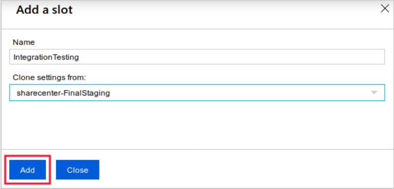

# Stage a web app deployment for testing and rollback by using App Service deployment slots

# Create a deployment slot

1. Open your web app in the Azure portal.
2. Select the Deployment Slots pane.
3. Select Add Slot.
4. Name the slot.
5. Choose whether to clone settings from another slot. If you choose to clone, settings are copied to your new slot from the slot you specify.
   

```
git config --global user.name <your-username>
```
