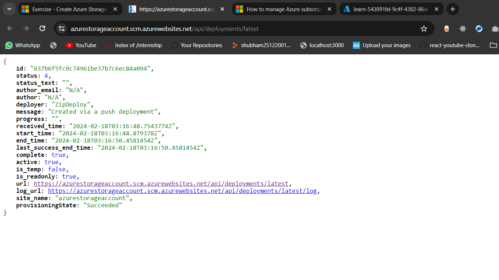

# Store application data with Azure Blob Storage

## What are blobs?

Blobs are files for the cloud. Apps work with blobs in much the same way as they work with files on a disk. Apps read and write data to blobs. However, unlike a local file, you can reach blobs from anywhere with an internet connection.

Azure Blob Storage is unstructured. There are no restrictions on the kinds of data it can hold. For example, a blob can hold a PDF document, a JPG image, a JSON file, video content, and more.

Blobs aren't limited to common file formats. A blob could contain gigabytes of binary data streamed from a scientific instrument, an encrypted message for another application, or data in a custom format for an app you're developing.

## Design a storage organization strategy

When you design an app that needs to store data, it's important to think about how the app is going to organize data across storage accounts, containers, and blobs.

### Storage accounts

A single storage account is flexible enough to organize your blobs. However, you should use more storage accounts as necessary to logically separate costs and control access to data.

### Containers and blobs

The nature of your app and the data it stores should drive your strategy for naming and organizing containers and blobs.

Apps that use blobs as part of a storage scheme that includes a database often don't need to rely heavily on organization, naming, or metadata to indicate anything about their data. Such apps commonly use identifiers like GUIDs as blob names and reference these identifiers in database records. The app uses the database to determine where blobs are stored and the kind of data they contain.

## Exercise - Blob uploads and downloads

### Create new blobs

- In the editor, in BlobStorage.cs, replace Save with the following code. Use CTRL+S to save your work.

```
public Task Save(Stream fileStream, string name)
{
    BlobServiceClient blobServiceClient = new BlobServiceClient(storageConfig.ConnectionString);

    // Get the container (folder) the file will be saved in
    BlobContainerClient containerClient = blobServiceClient.GetBlobContainerClient(storageConfig.FileContainerName);

    // Get the Blob Client used to interact with (including create) the blob
    BlobClient blobClient = containerClient.GetBlobClient(name);

    // Upload the blob
    return blobClient.UploadAsync(fileStream);
}
```

- Replace Load with this code and save your work using CTRL + S.

```
public Task<Stream> Load(string name)
{
    BlobServiceClient blobServiceClient = new BlobServiceClient(storageConfig.ConnectionString);

    // Get the container the blobs are saved in
    BlobContainerClient containerClient = blobServiceClient.GetBlobContainerClient(storageConfig.FileContainerName);

    // Get a client to operate on the blob so we can read it.
    BlobClient blobClient = containerClient.GetBlobClient(name);

    return blobClient.OpenReadAsync();
}
```

### Deploy and run in Azure

```
az appservice plan create --name blob-exercise-plan --resource-group learn-543091fd-9c4f-4382-86af-6722220bdccd --sku FREE --location eastus
```

```
az webapp create --name <your-unique-app-name> --plan blob-exercise-plan --resource-group learn-543091fd-9c4f-4382-86af-6722220bdccd
```

Example

```
az webapp create --name azurestorageaccount --plan blob-exercise-plan --resource-group learn-543091fd-9c4f-4382-86af-6722220bdccd
```

```
CONNECTIONSTRING=$(az storage account show-connection-string --name <your-unique-storage-account-name> --resource-group learn-543091fd-9c4f-4382-86af-6722220bdccd --output tsv)
```

Example

```
CONNECTIONSTRING=$(az storage account show-connection-string --name cloudshell1107978403 --resource-group learn-543091fd-9c4f-4382-86af-6722220bdccd --output tsv)
```

```
az webapp config appsettings set --name <your-unique-app-name> --resource-group learn-543091fd-9c4f-4382-86af-6722220bdccd --settings AzureStorageConfig:ConnectionString=$CONNECTIONSTRING AzureStorageConfig:FileContainerName=files
```

Example

```
az webapp config appsettings set --name azurestorageaccount --resource-group learn-543091fd-9c4f-4382-86af-6722220bdccd --settings AzureStorageConfig:ConnectionString=$CONNECTIONSTRING AzureStorageConfig:FileContainerName=files
```

## Deploy your app.

```
dotnet publish -o pub
cd pub
zip -r ../site.zip *
```

```
az webapp deployment source config-zip --src ../site.zip --name <your-unique-app-name> --resource-group learn-543091fd-9c4f-4382-86af-6722220bdccd
```

Example

```
az webapp deployment source config-zip --src ../site.zip --name azurestorageaccount --resource-group learn-543091fd-9c4f-4382-86af-6722220bdccd
```



URL

```
https://azurestorageaccount.scm.azurewebsites.net/api/deployments/latest
```

```
https://<your-unique-app-name>.azurewebsites.net
```

Example

```
https://azurestorageaccount.azurewebsites.net
```

```
az storage blob list --account-name --container-name files --query [].{Name:name} --output table
```

Example

```
az storage blob list --account-name cloudshell1107978403 --container-name files --query [].{Name:name} --output table
```

msbuild FileUploader.csproj
